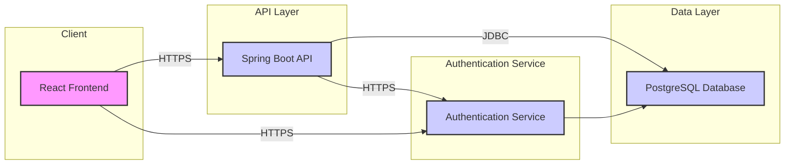
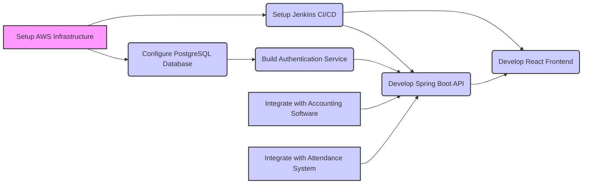

```markdown
# Technical Report: Payroll System Tech Stack

## 1. Executive Summary

This report outlines the recommended technology stack for developing a robust, scalable, and secure payroll system. The proposed architecture leverages modern technologies and industry best practices to meet the functional and non-functional requirements defined in the RFP. Key recommendations include:

*   **Frontend:** React with TypeScript for a responsive and maintainable user interface (US-013, US-014).
*   **Backend:** Spring Boot (Java) for building a scalable and secure API (US-003, US-005).
*   **Database:** PostgreSQL for reliable data storage (US-001, US-002).
*   **Cloud Infrastructure:** AWS for scalable and cost-effective deployment (REQ-015).
*   **DevOps:** Jenkins, Docker, and Kubernetes for CI/CD and container orchestration.
*   **Security:** Implement comprehensive security measures including encryption, role-based access control, and regular security audits (REQ-014, REQ-015).

These recommendations are strategically aligned with the business goals of accurate and timely salary processing, compliance with tax regulations, efficient payslip generation, and data security.

## 2. Detailed System Architecture

### 2.1 System Architecture Diagram



### 2.2 Component Descriptions

*   **React Frontend:** The user interface layer, built with React and TypeScript, provides a responsive and intuitive experience for users to interact with the system. It handles user input, displays data, and communicates with the backend API.
*   **Spring Boot API:** The backend API layer, built with Spring Boot (Java), exposes RESTful endpoints for the frontend to consume. It handles business logic, data validation, and interacts with the database.
*   **PostgreSQL Database:** The data storage layer, using PostgreSQL, stores all persistent data for the system, including employee details, salary information, tax rules, and user accounts.
*   **Authentication Service:** A dedicated service to handle authentication and authorization, ensuring secure access to the system.

### 2.3 Interaction Patterns

1.  The user interacts with the React Frontend to perform actions like adding employee details or viewing payslips.
2.  The React Frontend sends HTTPS requests to the Spring Boot API to perform backend operations.
3.  The Spring Boot API processes the requests, performs necessary data validation and business logic, and interacts with the PostgreSQL Database to retrieve or store data.
4.  The Spring Boot API returns the results to the React Frontend for display to the user.
5.  All API requests are authenticated using the Authentication Service.

## 3. Technology Stack Analysis

| Component          | Technology        | Version     | Licensing   | Justification                                                                                                                                                    | Requirements Addressed                                                                        |
| ------------------ | ----------------- | ----------- | ----------- | -------------------------------------------------------------------------------------------------------------------------------------------------------------- | --------------------------------------------------------------------------------------------- |
| Frontend           | React             | 18.x        | MIT         | Component-based architecture, large community, excellent performance, TypeScript support for maintainability.                                                    | US-010, US-013, US-014                                                                      |
| Frontend           | TypeScript        | 4.x         | Apache 2.0  | Provides static typing for improved code quality and maintainability.                                                                                          | US-001, US-002, US-007, US-014                                                              |
| Backend            | Spring Boot (Java) | 3.x         | Apache 2.0  | Scalable, secure, and robust framework for building APIs. Mature ecosystem, extensive documentation, and strong community support.                            | US-001, US-002, US-003, US-004, US-005, US-006, US-007, US-008, US-011, US-012                     |
| Database           | PostgreSQL        | 15.x        | PostgreSQL  | Reliable, open-source relational database with excellent performance and scalability. ACID-compliant, supports advanced data types and features.             | US-001, US-002, US-003, US-004, US-005, US-006, US-007, US-008, US-011, US-012                     |
| Cloud Infrastructure | AWS               | N/A         | N/A         | Scalable, cost-effective, and secure cloud platform with a wide range of services.                                                                          | REQ-015                                                                                       |
| DevOps             | Jenkins           | LTS         | MIT         | Open-source automation server for CI/CD. Extensible with plugins, supports various build and deployment tools.                                                  | All stories requiring automation                                                              |
| DevOps             | Docker            | Latest      | Apache 2.0  | Containerization platform for packaging and deploying applications. Ensures consistency across different environments.                                       | All stories requiring containerization                                                          |
| DevOps             | Kubernetes        | Latest      | Apache 2.0  | Container orchestration platform for managing and scaling containerized applications.                                                                        | All stories requiring scalability                                                               |
| Security           | Spring Security   | 6.x         | Apache 2.0  | Comprehensive security framework for Spring Boot applications. Provides authentication, authorization, and protection against common web vulnerabilities. | US-009, US-010, REQ-005, REQ-014, REQ-015                                                      |

## 4. Comparative Analysis of Alternative Technologies

### 4.1 Frontend Technologies

| Feature             | React       | Angular     | Vue.js      | Decision                                                      |
| ------------------- | ----------- | ----------- | ----------- | ------------------------------------------------------------- |
| Component Model     | Yes         | Yes         | Yes         | All frameworks support component-based architecture.           |
| Virtual DOM         | Yes         | No          | Yes         | React and Vue.js offer better performance with Virtual DOM. |
| Data Binding        | One-way     | Two-way     | Two-way     | React's one-way data binding promotes better data flow.      |
| Learning Curve      | Medium      | High        | Low         | React offers a balance between ease of use and flexibility.   |
| Community Support   | Large       | Large       | Growing     | React and Angular have large communities, ensuring support.    |
| TypeScript Support  | Excellent   | Excellent   | Good        | React and Angular provide excellent TypeScript support.       |
| **Recommendation** | **React**   |             |             | React offers a good balance of features, performance, and maintainability, particularly with TypeScript support. |

### 4.2 Backend Technologies

| Feature             | Spring Boot (Java) | Node.js (Express) | Django (Python) | Decision                                                                                                  |
| ------------------- | ------------------ | ----------------- | --------------- | --------------------------------------------------------------------------------------------------------- |
| Performance         | High               | High              | Medium          | Spring Boot and Node.js offer high performance.                                                           |
| Scalability         | High               | High              | Medium          | All can scale well with proper architecture, Spring Boot particularly suited for enterprise scalability. |
| Security            | High               | Medium              | Medium          | Spring Boot offers robust security features and a mature ecosystem.                                          |
| Development Speed   | Medium              | High              | High            | Node.js and Django enable faster development, but Spring Boot provides better long-term maintainability.    |
| Community Support   | Large               | Large              | Large           | All have large communities.                                                                               |
| **Recommendation** | **Spring Boot**    |                   |                 | Spring Boot provides a good balance of performance, scalability, security, and maintainability.             |

### 4.3 Database Technologies

| Feature          | PostgreSQL | MySQL   | MongoDB | Decision                                                                                                             |
| ---------------- | ---------- | ------- | ------- | -------------------------------------------------------------------------------------------------------------------- |
| Data Consistency | ACID       | ACID    | BASE    | PostgreSQL and MySQL ensure strong data consistency with ACID properties.                                             |
| Scalability      | High       | High    | High    | All databases can scale well.                                                                                         |
| Data Structure   | Relational | Relational | Document | PostgreSQL is well-suited for structured data and complex queries required for payroll processing.                             |
| Community Support| Large      | Large   | Large   | All have strong community support.                                                                                    |
| **Recommendation**| **PostgreSQL**       |         |         | PostgreSQL is the best choice for relational data, ACID compliance, and complex query capabilities.                          |

## 5. Detailed Implementation Roadmap

### 5.1 Dependency Graph



### 5.2 Critical Path Analysis

The critical path includes setting up the AWS infrastructure, configuring the PostgreSQL database, building the authentication service, developing the Spring Boot API, and developing the React Frontend. These tasks must be completed in sequence to ensure the system's core functionality.

### 5.3 Resource Requirements

| Task                       | Resources Required                    | Estimated Time |
| -------------------------- | ------------------------------------- | -------------- |
| AWS Infrastructure Setup   | DevOps Engineer                       | 1 week         |
| PostgreSQL Configuration   | Database Administrator                | 1 week         |
| Authentication Service     | Backend Developer                     | 2 weeks        |
| Spring Boot API Development | Backend Developers (2)                 | 8 weeks        |
| React Frontend Development | Frontend Developers (2)                | 8 weeks        |
| System Integration         | Full-Stack Developers (2)              | 4 weeks        |
| Testing                    | QA Engineers (2)                      | 4 weeks        |
| Deployment                 | DevOps Engineer                       | 1 week         |

## 6. Scalability and Performance Engineering

### 6.1 Capacity Models

*   **User Load:** The system should support up to 1000 concurrent users.
*   **Data Volume:** The database should be able to store data for up to 5 years.
*   **Transaction Rate:** The system should be able to process 100 payroll transactions per minute.

### 6.2 Optimization Strategies

*   **Database Indexing:** Optimize database queries by creating indexes on frequently accessed columns.
*   **Caching:** Implement caching mechanisms to reduce database load and improve response times.
*   **Load Balancing:** Distribute traffic across multiple servers to ensure high availability and performance.
*   **Asynchronous Processing:** Use message queues to handle long-running tasks asynchronously, improving responsiveness.

## 7. Comprehensive Security Architecture

### 7.1 Authentication and Authorization

*   Implement a secure authentication mechanism using industry-standard protocols like OAuth 2.0.
*   Enforce role-based access control (RBAC) to restrict access to sensitive data and functionality based on user roles (REQ-014).

### 7.2 Data Protection

*   Encrypt sensitive data at rest and in transit using strong encryption algorithms (REQ-015).
*   Implement data masking techniques to protect sensitive data from unauthorized access.

### 7.3 Network Security

*   Use firewalls and intrusion detection systems to protect the system from network-based attacks.
*   Regularly monitor network traffic for suspicious activity.

### 7.4 Compliance Controls

*   Adhere to relevant data privacy regulations, such as GDPR and CCPA.
*   Regularly audit the system for security vulnerabilities and compliance issues.

## 8. Development Workflow and DevOps Practices

### 8.1 CI/CD Pipeline

*   Use Jenkins to automate the build, test, and deployment process.
*   Implement automated testing at each stage of the pipeline to ensure code quality.

### 8.2 Environment Management

*   Use Docker to containerize the application and ensure consistency across different environments.
*   Use Kubernetes to orchestrate the deployment and scaling of containerized applications.

### 8.3 Quality Gates

*   Implement quality gates at each stage of the CI/CD pipeline to ensure that only high-quality code is deployed to production.
*   Use static code analysis tools to identify potential code defects and security vulnerabilities.

## 9. Testing Strategy

### 9.1 Unit Testing

*   Write unit tests for all core components to ensure that they function correctly in isolation.

### 9.2 Integration Testing

*   Write integration tests to verify that different components of the system work together correctly.

### 9.3 Performance Testing

*   Conduct performance tests to ensure that the system can handle the expected user load and transaction rate.

### 9.4 Security Testing

*   Perform security testing to identify and address potential security vulnerabilities.

## 10. Deployment Architecture

### 10.1 Infrastructure-as-Code

*   Use Terraform or CloudFormation to define and provision the infrastructure in code.
*   Automate the deployment process using Jenkins.

### 10.2 Scaling Strategies

*   Use horizontal scaling to distribute traffic across multiple servers.
*   Use auto-scaling to automatically adjust the number of servers based on demand.

### 10.3 Monitoring Solutions

*   Use Prometheus and Grafana to monitor the system's performance and health.
*   Set up alerts to notify administrators of potential issues.

## 11. Operational Support Model

### 11.1 Incident Management

*   Establish a clear incident management process for handling system outages and other issues.
*   Use a ticketing system to track and resolve incidents.

### 11.2 SLA Frameworks

*   Define service level agreements (SLAs) for system availability and performance.
*   Regularly monitor SLA performance and take corrective action when necessary.

## 12. Technology Risk Register

| Risk                                | Mitigation Strategy                                                              |
| ----------------------------------- | ------------------------------------------------------------------------------ |
| Security Vulnerabilities            | Implement regular security audits, penetration testing, and code reviews.         |
| Data Loss                           | Implement regular backups, disaster recovery planning, and data replication.     |
| Performance Bottlenecks             | Implement performance monitoring, load testing, and optimization strategies.      |
| Integration Issues                  | Conduct thorough integration testing, use standardized APIs, and establish clear communication channels. |
| Compliance Violations              | Implement regular compliance audits, stay up-to-date on regulatory changes, and consult with legal experts. |
| Lack of Skilled Resources           | Provide training, hire experienced personnel, and outsource specialized tasks. |
| Technology Obsolescence             | Monitor emerging technology trends, plan for technology upgrades, and use modular architecture.           |

This technical report provides a comprehensive overview of the recommended technology stack for the payroll system. By following these guidelines, the project team can build a robust, scalable, and secure system that meets the needs of the business.
```