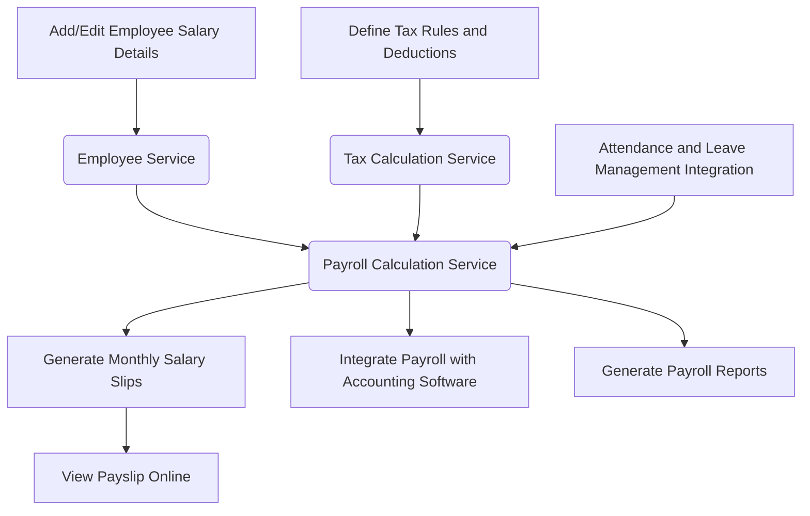

```markdown
# Payroll System Technical Report

## 1. Executive Summary

This report outlines the recommended technology stack for a new payroll system designed to meet the requirements specified in the RFP. The proposed stack prioritizes scalability, security, maintainability, and cost-effectiveness. We recommend a modern, cloud-native architecture leveraging microservices and robust security measures. The chosen technologies align with industry best practices and ensure the system can adapt to future business needs.

## 2. Detailed System Architecture

### 2.1. Architecture Diagram

```mermaid
graph LR
    subgraph Cloud Provider
        subgraph Load Balancer
            A[Internet] --> B(Load Balancer);
        end
        B --> C{API Gateway};
        subgraph Microservices
            C --> D[Authentication Service];
            C --> E[Employee Service];
            C --> F[Payroll Calculation Service];
            C --> G[Tax Calculation Service];
            C --> H[Reporting Service];
            C --> I[Integration Service];
        end

        subgraph Databases
            D --> J[User Database];
            E --> K[Employee Data Database];
            F --> L[Payroll Data Database];
            G --> M[Tax Rules Database];
        end

        subgraph Message Queue
            F --> N[Message Queue (e.g., Kafka)];
            N --> H;
            N --> I;
        end

    end
    subgraph External Systems
      O[Accounting Software]
      P[Attendance and Leave System]
    end

    I --> O
    I --> P
    style B fill:#f9f,stroke:#333,stroke-width:2px
    style C fill:#ccf,stroke:#333,stroke-width:2px
    style D fill:#f9f,stroke:#333,stroke-width:2px
    style E fill:#f9f,stroke:#333,stroke-width:2px
    style F fill:#f9f,stroke:#333,stroke-width:2px
    style G fill:#f9f,stroke:#333,stroke-width:2px
    style H fill:#f9f,stroke:#333,stroke-width:2px
    style I fill:#f9f,stroke:#333,stroke-width:2px
    style J fill:#f9f,stroke:#333,stroke-width:2px
    style K fill:#f9f,stroke:#333,stroke-width:2px
    style L fill:#f9f,stroke:#333,stroke-width:2px
    style M fill:#f9f,stroke:#333,stroke-width:2px
    style N fill:#f9f,stroke:#333,stroke-width:2px
    style O fill:#f9f,stroke:#333,stroke-width:2px
    style P fill:#f9f,stroke:#333,stroke-width:2px
```

### 2.2. Component Descriptions

*   **Load Balancer:** Distributes incoming traffic across multiple instances of the API Gateway for high availability and scalability.
*   **API Gateway:** Acts as a single entry point for all client requests, handling authentication, authorization, and routing requests to the appropriate microservices.
*   **Microservices:**
    *   **Authentication Service:** Handles user authentication and authorization (REQ-005, REQ-014, G-017).
    *   **Employee Service:** Manages employee data (REQ-007, G-004, US-004).
    *   **Payroll Calculation Service:** Performs the core payroll calculations (REQ-001, REQ-016, G-001, US-001).
    *   **Tax Calculation Service:** Calculates taxes and ensures compliance (REQ-002, REQ-008, G-002, US-002).
    *   **Reporting Service:** Generates payroll reports and payslips (REQ-004, REQ-009, REQ-013, G-003, G-005, US-003, US-005).
    *   **Integration Service:** Handles integration with external systems such as accounting software and attendance/leave management systems (REQ-003, REQ-006, REQ-012, G-010, G-018, US-007, US-012).
*   **Databases:**
    *   **User Database:** Stores user credentials and role information.
    *   **Employee Data Database:** Stores employee-related information (e.g., personal details, salary, benefits).
    *   **Payroll Data Database:** Stores payroll calculation results and history.
    *   **Tax Rules Database:** Stores tax rules and regulations.
*   **Message Queue:** Enables asynchronous communication between microservices, improving system resilience and scalability (e.g., Kafka, RabbitMQ).
*   **External Systems:** Represents integrations with external accounting software and attendance/leave management systems.

### 2.3. Interaction Patterns

*   Clients (e.g., web browser, mobile app) send requests to the API Gateway.
*   The API Gateway authenticates and authorizes the request.
*   The API Gateway routes the request to the appropriate microservice.
*   Microservices interact with databases to retrieve and store data.
*   Microservices communicate with each other asynchronously via the Message Queue for tasks like reporting and integration.

## 3. Technology Stack Analysis

| Layer            | Technology           | Version | Licensing  | Justification                                                                                                                                                                                                 |
| ---------------- | -------------------- | ------- | ---------- | ------------------------------------------------------------------------------------------------------------------------------------------------------------------------------------------------------------- |
| **Frontend**     | React                | 18.x    | MIT        | Component-based architecture for building interactive UIs, supports efficient updates, large community, reusable components, meets REQ-010 and US-008 for user-friendly payslip viewing.                        |
|                  | Redux (Optional)     | 4.x     | MIT        | State management library, simplifies complex data flow, beneficial for managing user sessions and application state.                                                                                           |
|                  | Material-UI/Ant Design | 5.x     | MIT        | UI component libraries provide pre-built components, accelerates development, ensures consistency across the application.                                                                                  |
| **Backend**      | Node.js              | 18.x    | MIT        | JavaScript runtime, enables full-stack JavaScript development, non-blocking I/O for high performance, supports asynchronous operations, suitable for building scalable APIs, fast processing, REQ-016. |
|                  | Express.js           | 4.x     | MIT        | Web application framework, simplifies API development, provides routing and middleware functionality.                                                                                                    |
| **API**          | RESTful APIs         | -       | -          | Standard for building web APIs, lightweight, easy to implement and consume.                                                                                                                                  |
|                  | gRPC (Optional)      | 1.4x    | Apache 2.0 | High-performance RPC framework, efficient for internal microservice communication, supports multiple languages.                                                                                             |
| **Database**     | PostgreSQL           | 14.x    | PostgreSQL | Open-source, robust, ACID-compliant, supports complex queries, suitable for handling financial data, scalable, reliable, and supports data integrity crucial for payroll (G-004, US-004, REQ-007).     |
|                  | Redis (Optional)     | 7.x     | BSD        | In-memory data store, caching frequently accessed data, improves performance, reduces database load.                                                                                                       |
| **Cloud**        | AWS/Azure/GCP        | -       | Commercial | Scalable infrastructure, provides a wide range of services, supports microservices architecture, ensures high availability (REQ-015, G-016, US-010).                                                        |
| **DevOps**       | Docker               | 20.x    | Apache 2.0 | Containerization, ensures consistent environments across development, testing, and production.                                                                                                               |
|                  | Kubernetes           | 1.2x    | Apache 2.0 | Container orchestration, automates deployment, scaling, and management of containerized applications.                                                                                                    |
|                  | Jenkins/GitLab CI    | -       | MIT        | CI/CD pipeline, automates build, test, and deployment processes.                                                                                                                                           |
| **Security**     | OAuth 2.0            | -       | -          | Authentication and authorization framework, secures APIs, supports role-based access control (REQ-005, REQ-014, G-017, US-006).                                                                               |
|                  | JWT                | -       | -          | JSON Web Tokens, securely transmits information between parties as a JSON object.                                                                                                                      |
|                  | TLS/SSL              | -       | -          | Encryption protocol, secures data in transit.                                                                                                                                                               |
| **Integration**  | Apache Kafka       | 3.x     | Apache 2.0 | Distributed streaming platform, handles high-throughput data streams, suitable for integrating with external systems (REQ-003, REQ-006, REQ-012, G-010, G-018, US-007, US-012).                        |

## 4. Comparative Analysis

| Feature             | PostgreSQL             | MySQL                | MongoDB                |
| ------------------- | ---------------------- | -------------------- | ---------------------- |
| **Data Integrity**  | Excellent (ACID)       | Good (ACID support) | Limited (No ACID)      |
| **Scalability**     | High                   | Medium               | High                   |
| **Performance**     | High                   | Medium               | High (for specific use cases) |
| **Schema Flexibility** | Low                    | Low                  | High                   |
| **Use Case**        | Complex transactions, reporting | Web applications    | Unstructured data       |
| **Our Recommendation**| **Yes** (Payroll requires ACID properties) | No | No |

**Decision Matrix for Cloud Providers**

| Criteria          | AWS                               | Azure                             | GCP                               | Decision                       |
| ----------------- | --------------------------------- | --------------------------------- | --------------------------------- | ------------------------------ |
| **Scalability**   | Excellent                           | Excellent                           | Excellent                           | All are viable options       |
| **Cost**          | Competitive                         | Competitive                         | Competitive                         | Evaluate based on specific needs |
| **Services**      | Extensive                           | Extensive                           | Extensive                           | All are viable options       |
| **Integration**   | Wide range of integrations          | Wide range of integrations          | Wide range of integrations          | All are viable options       |
| **Existing Expertise** | [Evaluate based on team skill set] | [Evaluate based on team skill set] | [Evaluate based on team skill set] | Key factor in final decision  |

## 5. Detailed Implementation Roadmap

### 5.1. Dependency Graph



### 5.2. Critical Path Analysis

1.  **Database Setup:** Define schemas and establish connections (2 weeks).
2.  **Authentication Service:** Implement user authentication and role-based access control (3 weeks).
3.  **Employee Service:** Develop APIs for managing employee data (4 weeks).
4.  **Payroll Calculation Service:** Implement core payroll calculation logic (6 weeks).
5.  **Tax Calculation Service:** Integrate tax rules and calculations (5 weeks).
6.  **Reporting Service:** Develop APIs for generating payslips and reports (4 weeks).
7.  **Integration Service:** Integrate with accounting software and attendance/leave management systems (6 weeks).
8.  **Frontend Development:** Build user interfaces (8 weeks).
9.  **Testing and Deployment:** Perform comprehensive testing and deploy the system to production (4 weeks).

### 5.3. Resource Requirements

*   **Development Team:** 6-8 engineers (Frontend, Backend, DevOps, Security)
*   **Project Manager:** 1
*   **QA Engineer:** 2
*   **Infrastructure:** Cloud resources, servers, databases
*   **Tools:** IDEs, testing tools, CI/CD tools

## 6. Scalability and Performance Engineering

### 6.1. Capacity Models

*   **Employee Count:** System should handle payroll for up to \[X] employees (REQ-015).
*   **Transaction Volume:** Estimate the number of payroll transactions per month.
*   **Peak Load:** Design for peak load during payroll processing periods.

### 6.2. Optimization Strategies

*   **Caching:** Implement caching for frequently accessed data (e.g., employee data, tax rules) using Redis.
*   **Database Optimization:** Optimize database queries and indexing.
*   **Load Balancing:** Distribute traffic across multiple instances of microservices.
*   **Asynchronous Processing:** Use message queues (e.g., Kafka) for long-running tasks.
*   **Code Profiling:** Regularly profile code to identify performance bottlenecks.

## 7. Comprehensive Security Architecture

### 7.1. Authentication and Authorization

*   Implement OAuth 2.0 for authentication and authorization.
*   Use JWT for securely transmitting user information.
*   Implement role-based access control (RBAC) to restrict access to sensitive data and functionalities (REQ-005, REQ-014, G-017, US-006).

### 7.2. Data Protection

*   Encrypt sensitive data at rest and in transit using TLS/SSL.
*   Implement data masking to protect personally identifiable information (PII).
*   Regularly back up data and store backups in a secure location.

### 7.3. Network Security

*   Use firewalls to restrict network access.
*   Implement intrusion detection and prevention systems.
*   Regularly monitor network traffic for suspicious activity.

### 7.4. Compliance Controls

*   Ensure compliance with relevant data privacy regulations (e.g., GDPR, CCPA).
*   Implement audit logging to track user activity and system events.
*   Conduct regular security audits and penetration testing.

## 8. Development Workflow and DevOps Practices

### 8.1. CI/CD Pipeline Specifications

*   **Code Repository:** Git
*   **Build Automation:** Jenkins/GitLab CI
*   **Testing Automation:** Unit tests, integration tests, performance tests, security tests
*   **Deployment Automation:** Kubernetes, Infrastructure-as-Code (IaC)

### 8.2. Environment Management

*   Use separate environments for development, testing, and production.
*   Automate environment provisioning using IaC (e.g., Terraform, CloudFormation).
*   Implement configuration management using tools like Ansible or Chef.

### 8.3. Quality Gates

*   Implement code review processes.
*   Enforce coding standards and best practices.
*   Automate testing at each stage of the CI/CD pipeline.
*   Monitor system performance and security metrics.

## 9. Testing Strategy

### 9.1. Unit Testing

*   Test individual components and functions in isolation.
*   Use mocking and stubbing to isolate dependencies.
*   Aim for high code coverage.

### 9.2. Integration Testing

*   Test interactions between different components and services.
*   Verify data flow and integration with external systems.

### 9.3. Performance Testing

*   Conduct load testing to simulate peak load conditions.
*   Identify performance bottlenecks and optimize system performance.
*   Ensure payroll calculations complete within \[X] seconds (REQ-016, G-001, US-001, US-011).

### 9.4. Security Testing

*   Conduct penetration testing to identify vulnerabilities.
*   Perform security audits to assess compliance with security policies.
*   Implement static and dynamic code analysis.

## 10. Deployment Architecture

### 10.1. Infrastructure-as-Code Templates

*   Use Terraform or CloudFormation to define and manage infrastructure.
*   Automate infrastructure provisioning and configuration.

### 10.2. Scaling Strategies

*   Implement horizontal scaling for microservices using Kubernetes.
*   Use auto-scaling to automatically adjust resources based on demand.
*   Monitor system performance and scale resources as needed.

### 10.3. Monitoring Solutions

*   Implement centralized logging using tools like ELK stack or Splunk.
*   Use Prometheus and Grafana for monitoring system metrics.
*   Set up alerts for critical events and performance thresholds.

## 11. Operational Support Model

### 11.1. Incident Management Processes

*   Establish clear incident response procedures.
*   Define escalation paths and communication protocols.
*   Use ticketing systems to track and manage incidents.

### 11.2. SLA Frameworks

*   Define service level agreements (SLAs) for system availability and performance.
*   Monitor SLA compliance and take corrective actions as needed.
*   Regularly review and update SLAs.

## 12. Technology Risk Register

| Risk                      | Description                                   | Mitigation Strategy                                                                                                                                                                                                                           |
| ------------------------- | --------------------------------------------- | ---------------------------------------------------------------------------------------------------------------------------------------------------------------------------------------------------------------------------------------------- |
| **Security Vulnerabilities** | Potential for data breaches and unauthorized access | Implement robust security measures, conduct regular security audits and penetration testing, keep software up to date, use strong encryption, and enforce multi-factor authentication.                                                  |
| **Scalability Issues**    | System may not handle increasing load           | Design for scalability from the beginning, use load balancing, caching, and asynchronous processing, monitor system performance, and scale resources as needed.                                                                             |
| **Integration Challenges**  | Difficulties integrating with external systems | Use standard integration protocols, develop clear APIs, conduct thorough integration testing, and establish communication channels with external system providers.                                                                          |
| **Tax Compliance Issues** | Errors in tax calculations and compliance       | Maintain a comprehensive tax rules database, automate tax calculations, conduct regular audits, and stay up to date with changing tax laws and regulations.                                                                                   |
| **Data Loss**               | Potential for data loss due to hardware failures | Implement regular data backups, store backups in a secure location, use redundant storage systems, and implement disaster recovery procedures.                                                                                              |
| **Performance Degradation** | Slow payroll processing times                | Optimize database queries, implement caching, use load balancing, and monitor system performance.                                                                                                                                          |

This report provides a comprehensive overview of the recommended technology stack and implementation strategies for the payroll system. By adhering to these guidelines, the system can be built to meet the requirements of the RFP, ensuring scalability, security, and maintainability while aligning with business goals.
```