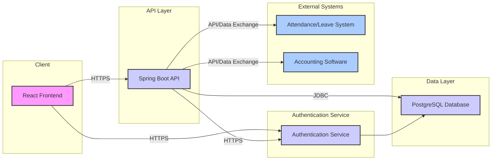

# Payroll System Development Proposal

## Prepared By: [Your Company Name]
## Prepared For: IEMCS
## Date: 3 June, 2025

[Placeholder for Company Logo - e.g., Image or Text Art]

---

## Contact Information

[Your Company Name]
[Your Address]
[Your Phone Number]
[Your Email Address]
[Your Website (Optional)]

---

# Table of Contents

| Section                                                              |
| :------------------------------------------------------------------- |
| [List Of Amendments On The Previous Version](#list-of-amendments-on-the-previous-version) |
| [Introduction](#introduction)                                        |
| [Proposed System Architecture](#proposed-system-architecture)        |
| [Work Packages Schedule And Budget](#work-packages-schedule-and-budget) |
| [Post Delivery Support](#post-delivery-support)                      |
| [Risk Analysis Identification Of Risk And Steps For Their Mitigation](#risk-analysis-identification-of-risk-and-steps-for-their-mitigation) |

---

# List Of Amendments On The Previous Version

This is the first version of the proposal. No amendments have been made to a previous version.

---

# Introduction

## Executive Summary

This proposal outlines a comprehensive plan for the design, development, and implementation of a modern, secure, and scalable payroll system for IEMCS. Based on a thorough understanding of your requirements, we propose a solution leveraging a robust technology stack including Spring Boot for the backend, React with TypeScript for the frontend, and PostgreSQL for the database, deployed on AWS infrastructure. This stack is specifically chosen for its enterprise-grade performance, security features, and long-term maintainability, ensuring compliance with tax regulations, accurate and timely salary processing, efficient payslip generation, and seamless integration with existing systems like attendance and accounting. The project is estimated to be completed within approximately 12 weeks, with a detailed plan for development, testing, and deployment, supported by a clear risk management strategy and post-implementation support plan. Our approach prioritizes data integrity, user experience for both Admin and Employee roles, and adherence to the highest standards of technical excellence and project management. A detailed breakdown of the project schedule and estimated costs can be found in the [Work Packages Schedule And Budget](#work-packages-schedule-and-budget) section.

**Objectives of the Proposal:**

*   To design and develop a modern, secure, and scalable payroll system for IEMCS.
*   To ensure compliance with tax regulations and labor laws.
*   To automate and streamline payroll processing, reducing manual effort and errors.
*   To provide accurate and timely salary payments to employees.
*   To generate detailed and informative payslips for employees.
*   To facilitate seamless integration with existing attendance and accounting systems.
*   To enhance data security and protect sensitive employee information.
*   To provide an intuitive and user-friendly experience for both administrators and employees.

## Broad Delivery Date

The broad delivery date for the completed payroll system is estimated to be approximately **12 weeks** from the project commencement date. Based on a potential start date around June 3, 2025, this targets a broad delivery by **late August 2025**. Specific milestone dates will be refined during the project planning phase.

## Acceptance Criteria

Acceptance of the delivered system will be based on the successful fulfillment of the detailed acceptance criteria defined for each user story. These criteria are designed to be clear, testable, and directly linked to the functional and non-functional requirements. Key areas for acceptance testing will include:

*   Accurate and timely processing of employee salaries (Core Payroll Processing).
*   Correct calculation and application of taxes and deductions based on defined rules (Tax Management and Compliance).
*   Successful generation and distribution of payslips (Payslip Generation and Distribution).
*   Accurate generation of required payroll reports (Reporting).
*   Enforcement of role-based access controls and data encryption standards (Security and Access Control).
*   Successful integration with specified external systems (System Integrations).
*   Functionality and usability of Employee Self-Service features (Employee Self-Service).

Formal acceptance sign-off will occur upon successful completion of User Acceptance Testing (UAT) against the agreed-upon criteria.

## Important Assumptions, Dependency & Constraints

*   **Client Availability:** Key IEMCS personnel (e.g., subject matter experts, IT representatives, decision-makers) will be available for requirements clarification, feedback, and acceptance testing as per the project schedule.
*   **Infrastructure Provisioning:** Necessary AWS infrastructure and access will be provisioned and configured in a timely manner according to the technical specifications.
*   **Third-Party System Access:** Necessary access and documentation for integrating with the existing attendance/leave management system and accounting software will be provided promptly.
*   **Scope Stability:** The project scope, as defined by the agreed-upon user stories and requirements, will remain stable throughout the development lifecycle. Any changes will be managed through a formal change control process, which may impact schedule and cost.
*   **Data Migration:** The scope assumes that initial data setup or migration of historical data is handled separately or is a limited activity within the project scope, requiring clear data formats and access from IEMCS.
*   **Regulatory Compliance:** Tax rules and regulations provided by IEMCS are assumed to be accurate and comprehensive for the required jurisdictions. Updates to regulations during the project may require scope adjustments.
*   **Team Composition & Rates:** The cost estimate is based on the assumed team composition and illustrative hourly rates detailed in the [Cost Estimate](#cost-estimate) section.

## IPR and Non-Disclosures

The Intellectual Property Rights (IPR) of the developed software would belong exclusively to IEMCS. [Your Company Name] and the individual engineers working on the project would sign the relevant Non-Disclosure Agreements (NDA) as is required by IEMCS.

## Scope of Work

The scope of work encompasses the design, development, testing, and deployment of a comprehensive payroll system. The system will address the core needs of IEMCS related to employee compensation, tax compliance, and reporting. The key features and purpose of the software are defined by the following functional areas (Epics):

*   **Core Payroll Processing:** Managing employee salary details, calculating gross and net pay, and processing payroll runs.
*   **Tax Management and Compliance:** Defining and applying tax rules and deductions to ensure compliance with relevant regulations.
*   **Payslip Generation and Distribution:** Automatically generating detailed payslips and providing mechanisms for their secure distribution to employees.
*   **Reporting:** Generating various payroll reports for administrative and management analysis.
*   **Security and Access Control:** Implementing robust security measures, including role-based access control and data encryption, to protect sensitive information.
*   **System Integrations:** Integrating with existing attendance/leave management and accounting systems to streamline data flow and processes.
*   **Employee Self-Service:** Providing employees with secure online access to view their payslips and update relevant tax declaration information.

A visual representation and detailed breakdown of the system's components can be found in the [Proposed System Architecture](#proposed-system-architecture) section.

### User Characteristics

The system is designed to serve two primary user types:

*   **Admin:** Users responsible for configuring the system, managing employee data, processing payroll, defining tax rules, generating reports, and managing integrations. These users require comprehensive access and control over the system's functionality.
*   **Employee:** Users who require secure access to view their personal payroll information, specifically payslips, and potentially update certain tax-related details via a self-service portal.

### General Constraints

*   **Compliance:** The system must adhere to relevant local and national tax laws and labor regulations.
*   **Security:** The system must protect sensitive employee and financial data through robust security measures.
*   **Performance:** The system must be capable of processing payroll for the entire organization efficiently and generating reports within acceptable timeframes.
*   **Integration:** The system must successfully integrate with the specified third-party attendance/leave management and accounting systems.
*   **Scalability:** The system must be designed to scale to accommodate future growth in the number of employees.

## Status Reporting

Status reporting will be conducted through **weekly teleconferences** and **weekly written status reports** delivered via email. These reports will summarize progress against the plan, highlight completed tasks, outline planned activities for the upcoming week, identify any risks or issues encountered, and track key performance indicators. Ad-hoc communication will be facilitated via email and instant messaging as needed.

---

# Proposed System Architecture

The proposed system architecture is designed for scalability, reliability, and security, following modern microservices principles where appropriate, centered around a robust backend API, a responsive frontend, and a reliable database. A [Top Level Diagram](#top-level-diagram) illustrates the main components, and the [Sub-Systems](#sub-systems) section provides a detailed breakdown.

## Software System Attributes

*   **Reliability:** The system will be designed to minimize downtime and errors, ensuring consistent and accurate payroll processing.
*   **Availability:** Leveraging cloud infrastructure (AWS) and appropriate deployment strategies (Kubernetes), the system will aim for high availability to ensure users can access it when needed.
*   **Maintainability:** The use of structured frameworks (Spring Boot, React), statically typed languages (Java, TypeScript), and clear coding standards will ensure the codebase is easy to understand, modify, and extend.
*   **Portability:** Containerization (Docker) allows the application to be easily deployed across different environments, enhancing portability.
*   **Application Security:** Comprehensive security measures, including authentication, authorization, encryption, and input validation, will be implemented to protect sensitive data and prevent unauthorized access.

## Top Level Diagram

### Product Description

The product is a web-based enterprise payroll management system designed to automate and streamline the process of calculating employee salaries, managing taxes and deductions, generating payslips, and providing necessary reports, while ensuring compliance and data security.

### Product Perspective

The payroll system will function as a central component within IEMCS's HR and Finance ecosystem. It will receive input from an attendance/leave management system and provide output to an accounting software, acting as the single source of truth for employee compensation data.

### Product Functions

The system will perform key functions including:

*   Managing employee salary profiles.
*   Processing payroll for defined periods.
*   Calculating gross pay, deductions, taxes, and net pay.
*   Generating and distributing payslips.
*   Defining and managing tax rules and compliance settings.
*   Generating various payroll reports (e.g., payroll register, tax reports).
*   Managing user roles and permissions.
*   Encrypting sensitive data.
*   Integrating with external systems for attendance/leave data and accounting entries.
*   Providing an Employee Self-Service portal for payslip viewing and tax declaration updates.

## Sub-Systems

The system is composed of the following key sub-systems:

### Frontend

Developed using React with TypeScript, this sub-system provides the user interface for administrators and employees. It handles user interactions, data presentation, and communicates with the Backend API via secure HTTPS requests.

### Backend API

Built with Spring Boot (Java), this sub-system contains the core business logic for payroll processing, tax calculations, data validation, and integration with external systems. It exposes RESTful APIs consumed by the Frontend and interacts with the Database. Spring Security is integrated here for authentication and authorization.

### Database

Utilizing PostgreSQL, this sub-system is the persistent data store for all system information, including employee details, salary history, tax configurations, payroll runs, and user data. Its relational structure and ACID compliance ensure data integrity.

### Authentication Service

A dedicated component (potentially part of the Spring Boot application or a separate microservice) responsible for user authentication and managing user sessions and tokens. It verifies user credentials and provides identity information to the Backend API for authorization decisions.

### Integration Modules

Specific components within the Backend API responsible for communicating with external systems, such as fetching attendance/leave data from the attendance system and pushing payroll journal entries to the accounting software. These modules handle data mapping and transfer protocols.

---

# Work Packages, Schedule And Budget

The project plan, including the broad schedule and estimated budget, is detailed in this section.

## Broad Effort Schedule of Work Packages

The project will follow an agile-like methodology with iterations within the 12-week timeline. The following table outlines the broad schedule and estimated effort allocation across key work packages.

| Activity/Output                                     | Estimated Duration (within 12 weeks) | Estimated Effort (Total Hours) | Deliverable                                   |
| :-------------------------------------------------- | :----------------------------------- | :----------------------------- | :-------------------------------------------- |
| Project Management, Planning & Communication        | Throughout (Weeks 1-12)              | 480                            | Project Management Plan, Weekly Reports, Meetings |
| Requirements Analysis & Refinement                  | Weeks 1-2                            | 480 (BA) + 160 (Dev)           | Refined User Stories, Functional Specs        |
| System Design & Architecture                        | Weeks 2-3                            | 320 (Dev) + 80 (BA)            | System Design Document, Database Schema       |
| Backend Development (Core Payroll, Tax, Payslips)   | Weeks 3-8                            | 960 (Dev)                      | Backend APIs, Business Logic, Unit Tests      |
| Backend Development (Reporting, Security, Integrations) | Weeks 6-10                           | 480 (Dev) + 240 (DevOps)       | Backend APIs, Security Implementation, Integration Code |
| Frontend Development (Admin & Employee Portals)     | Weeks 4-10                           | 960 (Dev)                      | User Interface, Frontend Logic, Component Tests |
| Module & Integration Testing                        | Weeks 8-11                           | 480 (QA) + 240 (Dev)           | Test Cases, Integration Test Reports          |
| System Testing & Performance Testing                | Weeks 10-11                          | 480 (QA) + 120 (Dev)           | System Test Reports, Performance Metrics      |
| Deployment & Infrastructure Configuration           | Weeks 11-12                          | 240 (DevOps) + 80 (Dev)        | Deployed Environments, Configuration Scripts  |
| User Acceptance Testing (UAT)                       | Week 12                              | 480 (Client) + 160 (QA)        | UAT Feedback, Acceptance Sign-off             |
| Documentation (Technical & User Manual)             | Weeks 10-12                          | 160 (BA) + 80 (Dev)            | Technical Documentation, User Manual          |

*Note: Effort allocation is approximate and may be adjusted based on detailed sprint planning. Refer to the [Cost Estimate](#cost-estimate) section for the corresponding budget breakdown.*

## Cost Estimate

The estimated cost for the project, based on the assumptions outlined in the Introduction, is detailed below:

| Role                | Number of FTEs | Hourly Rate | Hours per Week (per FTE) | Total Project Weeks | Total Hours (for Role) | Cost (for Role) |
| :------------------ | :------------- | :---------- | :----------------------- | :------------------ | :--------------------- | :-------------- |
| Project Manager     | 1              | $100        | 40                       | 12                  | 480                    | $48,000         |
| Business Analyst    | 1              | $90         | 40                       | 12                  | 480                    | $43,200         |
| Software Developer  | 3              | $80         | 40                       | 12                  | 1440                   | $115,200        |
| QA Tester           | 1              | $70         | 40                       | 12                  | 480                    | $33,600         |
| DevOps/System Admin | 0.5            | $95         | 40                       | 12                  | 240                    | $22,800         |
| **Subtotal (Base Cost)** |                |             |                          |                     |                        | **$262,800**    |
| **Contingency Buffer (20%)** |                |             |                          |                     |                        | **$52,560**     |
| **Total Project Budget** |                |             |                          |                     |                        | **$315,360**    |

*Note: This estimate covers personnel costs for the 12-week development phase and includes a contingency buffer. It does not include potential costs for third-party software licenses, cloud infrastructure usage fees, or significant data migration efforts unless explicitly included in the scope.*

## Invoice Dates

Payments will be milestone-based to align with project progress:

*   **Invoice 1:** [Percentage]% of Total Project Budget upon completion and approval of Requirements Analysis and System Design phases (approx. Week 4).
*   **Invoice 2:** [Percentage]% of Total Project Budget upon completion of core Backend and Frontend Development phases (approx. Week 8).
*   **Invoice 3:** [Percentage]% of Total Project Budget upon completion of System Testing and successful deployment to UAT environment (approx. Week 11).
*   **Final Invoice:** [Remaining Percentage]% of Total Project Budget upon successful completion of User Acceptance Testing and final system acceptance (approx. Week 12).

Specific percentages will be agreed upon in the final contract.

---

# Post Delivery Support

Following the successful deployment and acceptance of the payroll system, [Your Company Name] will provide a warranty period of [Number] days/months to address any bugs or issues found that were not identified during the testing phases. Support during this warranty period for fixing such issues will be non-billable.

Beyond the warranty period, or for any new feature requests or changes to the system (which are considered outside the initial scope), support and development services will be provided on a billable basis. A separate support and maintenance agreement can be negotiated to cover ongoing technical support, system monitoring, and future enhancements. This agreement would detail service level agreements (SLAs), response times, and applicable rates for billable work.

---

# Risk Analysis Identification Of Risk And Steps For Their Mitigation

This section identifies potential risks to the project and outlines the planned steps for their mitigation.

| Risk Factor                                       | Area of Impact             | Probability | Risk Management Plan                                                                                                                               |
| :------------------------------------------------ | :------------------------- | :---------- | :------------------------------------------------------------------------------------------------------------------------------------------------- |
| Manpower Turnover                                 | Schedule Overrun, Quality  | Low         | Maintain comprehensive documentation; Cross-train team members; Have access to a pool of qualified alternative resources for substitution if needed. |
| Changes in scope and requirements                 | Schedule and Cost Overrun  | High        | Implement a formal change control process; Clearly document all requirements during analysis phase; Prioritize features based on business value.     |
| Client’s availability                             | Schedule and Cost Overrun  | Medium      | Establish clear communication protocols and scheduled meetings; Identify key client stakeholders and confirm their availability upfront; Escalate availability issues promptly. |
| Delay in providing Hardware & Software tools/Access | Schedule and Cost Overrun  | Medium      | Clearly define infrastructure and access requirements early; Proactively communicate needs and timelines to IEMCS IT team; Track provisioning progress. |
| Delay in approval of deliverables submitted       | Schedule and Cost Overrun  | High        | Define clear review cycles and approval timelines for deliverables (e.g., SRS, Design Document, UAT); Establish a single point of contact for approvals; Escalate delays impacting the critical path. |
| Integration Issues with External Systems          | Schedule Overrun, Functionality | Medium      | Conduct detailed analysis of external system APIs/data formats early; Develop integration tests; Maintain close communication with owners of external systems. |
| Security Vulnerabilities                          | Data Integrity, Reputation | Medium      | Implement secure coding practices; Conduct regular code reviews and security testing (including penetration testing if scope allows); Use established security frameworks (Spring Security). |
| Technology Obsolescence (Long Term)               | Maintainability, Support   | Low         | Use widely adopted, well-supported technologies; Design with modularity to allow for easier updates/replacements of components; Stay informed on technology trends. |
